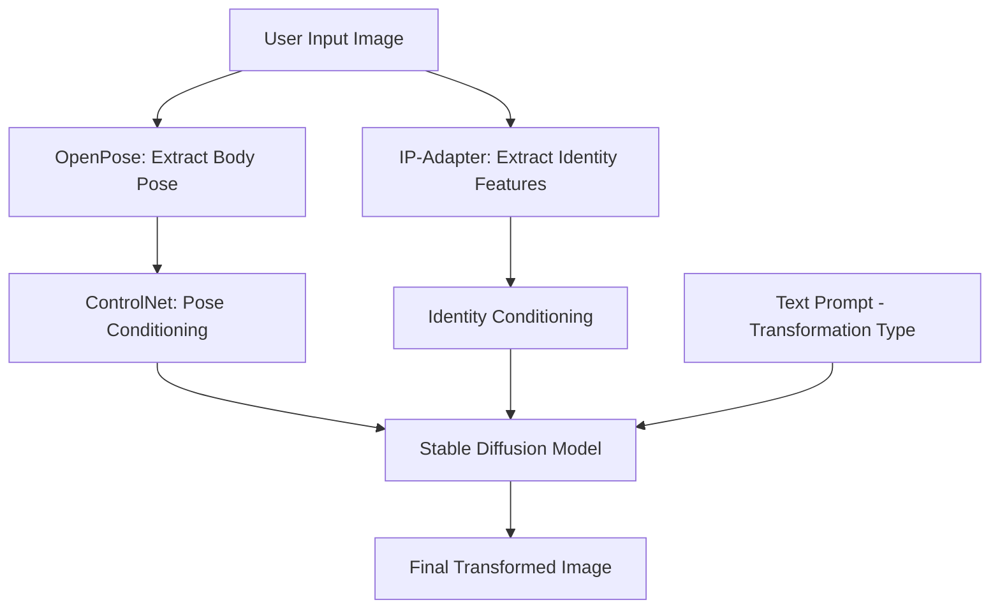

# AI-Based Fitness Transformation Generator

This project uses Stable Diffusion img2img to generate goal-based fitness transformations while preserving user identity (especially face shape and facial features).

## What Improved

- Goal presets with explicit identity-preserving prompts.
- Centralized model runtime config (device, dtype, scheduler, safety checker toggle).
- Reusable transformation service and benchmarking service.
- Unified CLI for generation and benchmark workflows.

## Project Structure

- `fitness_ai/config.py`: model/runtime settings.
- `fitness_ai/goals.py`: goal presets and prompt strategy.
- `fitness_ai/pipeline.py`: Diffusers pipeline creation and scheduler setup.
- `fitness_ai/image_io.py`: image loading/saving utilities.
- `fitness_ai/transform_service.py`: single-image generation service.
- `fitness_ai/benchmark_service.py`: strength-sweep benchmark + comparison grid.
- `fitness_ai/cli.py`: command-line entrypoint for generation and benchmarking.
- `transform.py`: interactive demo wrapper (goal choice menu).
- `test.py`: benchmark wrapper with default interview-friendly settings.

## Quick Start

1. Install dependencies:

```bash
pip install -r requirements.txt
```

2. Run interactive transformation demo:

```bash
python transform.py
```

3. Run benchmark grid generation:

```bash
python test.py
```

## Fitness Chatbot UI

An interactive fitness-only chatbot UI is available in `chatbot/` and can trigger the image transformation flow directly from chat.

Install chatbot UI dependency:

```bash
pip install -r chatbot/requirements.txt
```

Run from project root:

```bash
streamlit run chatbot/app.py
```

In chat, use:

- `/help`
- `/transform muscle_gain`
- `/transform fat_loss`

## CLI Examples

Generate one image:

```bash
python -m fitness_ai.cli generate --input image2.jpg --output output_transformation.png --goal muscle_gain --seed 7
```

Run benchmark over multiple strengths:

```bash
python -m fitness_ai.cli benchmark --input image2.jpg --goal fat_loss --strengths 0.28 0.35 0.45 --grid-output physique_transform_results.png
```

Use custom tuning parameters:

```bash
python -m fitness_ai.cli generate --input image2.jpg --output out.png --goal muscle_gain --strength 0.32 --guidance-scale 8.0 --steps 28 --prompt-suffix "natural lighting"
```


## Notes

- Default runtime is CPU to keep setup simple.
- If you need stronger privacy/safety enforcement, enable checker using `--enable-safety-checker`.
