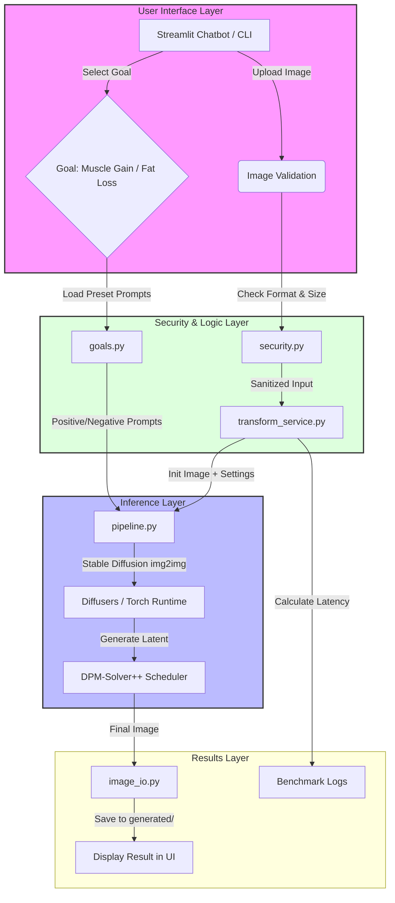

# Fitness Chatbot

This chatbot provides a friendly chat UI for fitness guidance and can run the project image transformation flow directly from chat.

## Features

- Fitness-only chat guardrail (off-topic messages are blocked).
- LLM-backed responses through an OpenAI-compatible Chat Completions API.
- Sidebar configuration for API provider, API key, model, base URL, temperature, and max tokens.
- Persistent settings across sessions in local storage (`chatbot/.runtime/settings.json`).
- Secure transformation command from chat: `/transform muscle_gain` or `/transform fat_loss`.
- Upload image via sidebar and generate transformed output from chat flow.
- Input hardening and guardrails:
  - message sanitization
  - blocked prompt-injection and command-like patterns
  - per-session rate limiting
  - strict image validation (type, size, decode checks)
  - safe output path generation
- Optional access token gate through environment variable.
- Audit logging to `chatbot/logs/audit.log`.

## Setup

Install all project dependencies from the root folder:

```bash
pip install -r requirements.txt
pip install -r chatbot/requirements.txt
```

## LLM Configuration

In the app sidebar under **LLM Settings**:

1. Choose your API provider.
2. Enter your API key.
3. Set model and optionally override base URL.
4. Click **Save LLM settings**.

These settings are persisted on disk so they remain available across restarts.

Supported provider presets:

- OpenAI
- OpenRouter
- Groq
- Together
- DeepSeek
- Custom (manual base URL)

## Run

From project root:

```bash
streamlit run chatbot/app.py
```

## Optional Access Control

Set an environment variable before launch:

```bash
set FITNESS_CHATBOT_ACCESS_TOKEN=your-secret-token
```

The app will require this token in the sidebar before use.

## Commands

- `/help`
- `/transform muscle_gain`
- `/transform fat_loss`

## Notes


- The app is configured to run the image pipeline on CPU by default.
- Generated images are saved in `chatbot/generated/`.
- Saved LLM settings are stored at `chatbot/.runtime/settings.json`.
- This is a fitness assistant and should not be used for medical diagnosis.
